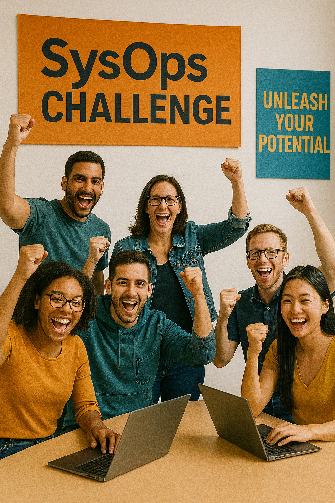
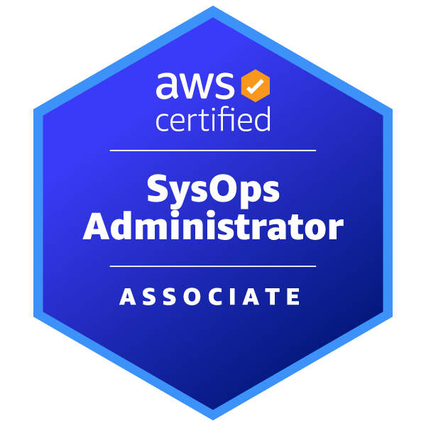

# 🚀 Challenge AWS SysOps Administrator – Serie de Laboratorios Prácticos

Prepárate para la certificación **AWS Certified SysOps Administrator – Associate** con esta serie completa de videos, sesiones en vivo y de **16 laboratorios prácticos** alineados a los dominios del examen oficial. Cada laboratorio está diseñado para que aprendas haciendo, con paso a paso, laboratorios en vivo, videos pregrabados y recursos descargables. 🌩️

---

### 🎯 Objetivo de Aprendizaje
Esta serie busca que desarrolles habilidades prácticas en despliegue, monitoreo, automatización, seguridad, redes y optimización de costos en AWS. Al finalizar, estarás listo para presentar el examen y enfrentar escenarios reales como SysOps.

---

### 🛠️ Servicios usados a lo largo de la serie
- Amazon EC2
- CloudWatch
- Systems Manager
- AWS Backup
- Auto Scaling
- Elastic Load Balancing (ALB)
- Amazon S3
- AWS Lambda
- IAM
- AWS KMS
- AWS Budgets y Cost Explorer

---

### 📆 Programación del Challenge (8 Semanas)
| Semana | Enfoque | Modalidad |
|--------|---------|-----------|
| 1 | Despliegue y Automatización | Sesión en vivo (teoría) |
| 2 | Laboratorios Módulo 1 | 1 en vivo + 3 pregrabados |
| 3 | Monitoreo y Logs | Sesión en vivo (teoría) |
| 4 | Laboratorios Módulo 2 | 1 en vivo + 2 pregrabados |
| 5 | Alta disponibilidad y recuperación | Sesión en vivo (teoría) |
| 6 | Laboratorios Módulo 3 | 1 en vivo + 2 pregrabados |
| 7 | Redes, Seguridad y Costos | Sesión en vivo (teoría) |
| 8 | Laboratorios Módulos 4-6 | 1 en vivo + 5 pregrabados |
| 9 | Laboratorios avanzados | en vivo o pregrabados |
| 10 | Sesión de Simulador examen en Kahoot | 1 en vivo + voucher 100% al primer puesto |

---

### 🧠 Recursos adicionales
- ✅ Plantillas paso a paso
- ✅ Videos explicativos de cada laboratorio
- ✅ Retos extra en cada práctica
- ✅ Sistema de puntos y premios

---

### ✅ Redes y Comunidad
- 📺 [Canal YouTube – CloudOps Guild](https://www.youtube.com/@CloudOpsGuildCommunity)
- 📝 [Blog Medium](https://medium.com/@marioserranopineda)
- 🌐 [Web Oficial](https://cloudopsguild.com/blog/)
- 💼 [LinkedIn – Mario Serrano](https://www.linkedin.com/in/mario-rodrigo-serrano-pineda/)
- 👥 [MeetUp AWS Cartagena](https://www.meetup.com/es-ES/aws-colombia-cartagena/)
- 📲 [Telegram Comunidad](https://t.me/awscloudopsguild)

### 🧭 Estructura General del Challenge (8 Semanas)

| Semana | Enfoque | Contenido | Modalidad |
|--------|--------|-----------|-----------|
| Semana 1 | Fundamentos y despliegue | Módulo 1: Deployment, Provisioning, and Automation | 🔴 Sesión en vivo |
| Semana 2 | Laboratorios del Módulo 1 | EC2, ASG, CloudFormation, Multi-tier | 🧪 1 en vivo + 3 pregrabados |
| Semana 3 | Monitoreo y remediación | Módulo 2: Monitoring, Logging, and Remediation | 🔴 Sesión en vivo |
| Semana 4 | Laboratorios del Módulo 2 | CloudWatch, Logs Insights, SSM | 🧪 1 en vivo + 2 pregrabados |
| Semana 5 | Alta disponibilidad y recuperación | Módulo 3: Reliability and Business Continuity | 🔴 Sesión en vivo |
| Semana 6 | Laboratorios del Módulo 3 | ASG, Backup, S3 Lifecycle | 🧪 1 en vivo + 2 pregrabados |
| Semana 7 | Redes, seguridad y costos | Módulos 4, 5 y 6 combinados | 🔴 Sesión en vivo |
| Semana 8 | Laboratorios módulos 4, 5 y 6 | VPC, ELB, IAM, KMS, Budgets | 🧪 1 en vivo + 5 pregrabados |

---

### 🔎 Detalle Semana a Semana

**Semana 1: Fundamentos y Despliegue (Teoría)**
- Provisionamiento con EC2, ASG y ALB
- Introducción a CloudFormation
- 👉 Sesión en vivo con demostración básica

**Semana 2: Laboratorios Módulo 1**
- 🧪 Laboratorio en vivo: EC2 + User Data
- 📼 Pregrabados:
  - Auto Scaling con ALB
  - CloudFormation básico
  - Arquitectura Multi-tier

**Semana 3: Monitoreo y Logs (Teoría)**
- Métricas, logs y alarmas con CloudWatch
- Run Command y monitoreo proactivo
- 👉 Sesión en vivo con dashboards

**Semana 4: Laboratorios Módulo 2**
- 🧪 Laboratorio en vivo: Logs Insights y alarmas
- 📼 Pregrabados:
  - Instalación del agente CloudWatch
  - Diagnóstico con SSM

**Semana 5: Alta Disponibilidad y Recuperación (Teoría)**
- Estrategias de resiliencia y backup
- 👉 Sesión en vivo con ejemplos de recuperación

**Semana 6: Laboratorios Módulo 3**
- 🧪 Laboratorio en vivo: ASG escalado automático
- 📼 Pregrabados:
  - Backup con AWS Backup
  - Políticas de ciclo de vida en S3

**Semana 7: Redes, Seguridad y Costos (Teoría)**
- Fundamentos de VPC, IAM, KMS y Budgets
- 👉 Sesión en vivo con overview de dominios cruzados

**Semana 8: Laboratorios Módulos 4-6**
- 🧪 Laboratorio en vivo: Troubleshooting VPC
- 📼 Pregrabados:
  - Balanceador con ELB
  - Auditoría con Trusted Advisor
  - IAM granular
  - Cifrado con KMS y S3
  - Presupuestos y Cost Explorer

### 🧪 Laboratorios incluidos

  # 📘 Resumen de Laboratorios - Challenge AWS SysOps (8 Semanas)

Cada laboratorio está alineado a los dominios oficiales del examen AWS Certified SysOps Administrator – Associate. Los laboratorios en vivo son parte de las sesiones semanales, mientras que los pregrabados estarán disponibles en el [canal CloudOps Guild](https://www.youtube.com/@CloudOpsGuildCommunity).

| Laboratorio                                                      | Modalidad   | Dominio del examen                       |
|:-----------------------------------------------------------------|:------------|:-----------------------------------------|
| EC2 con User Data                                                | En vivo     | Deployment, Provisioning, and Automation |
| Auto Scaling con ALB                                             | Pregrabado  | Deployment, Provisioning, and Automation |
| CloudFormation básico                                            | Pregrabado  | Deployment, Provisioning, and Automation |
| Arquitectura Multi-tier con CloudFormation                       | Pregrabado  | Deployment, Provisioning, and Automation |
| Logs Insights + alarmas personalizadas                           | En vivo     | Monitoring, Logging, and Remediation     |
| Instalación del agente de CloudWatch                             | Pregrabado  | Monitoring, Logging, and Remediation     |
| Diagnóstico con Systems Manager                                  | Pregrabado  | Monitoring, Logging, and Remediation     |
| ASG con escalado automático                                      | En vivo     | Reliability and Business Continuity      |
| Backup + restauración con AWS Backup                             | Pregrabado  | Reliability and Business Continuity      |
| Ciclo de vida de objetos S3                                      | Pregrabado  | Reliability and Business Continuity      |
| VPC + Troubleshooting de conectividad                            | En vivo     | Networking and Content Delivery          |
| Balanceador de carga con ELB + Target Groups                     | Pregrabado  | Networking and Content Delivery          |
| Auditoría de seguridad con Trusted Advisor e IAM Access Analyzer | Pregrabado  | Security and Compliance                  |
| Políticas IAM para acceso granular                               | Pregrabado  | Security and Compliance                  |
| Cifrado de objetos con KMS y S3                                  | Pregrabado  | Security and Compliance                  |
| Gestión de costos con AWS Budgets y Cost Explorer                | Pregrabado  | Cost and Performance Optimization        |

## Recursos del challenge

**1. [Paths de certificación](./recursos/AWS_certification_paths.pdf)**

**2. [Guía del examen AWS Certified SysOps Administrator Associate](./recursos/AWS-Certified-SysOps-Administrator-Associate_Exam-Guide.pdf)**

3. Plan de estudios

4. Guía pdf: 50 términos, conceptos y servicios más relevantes para el AI Practitioner

5. Checklist de estudio

6. guía de estudio

7. Listado de preguntas frecuentes sobre la certificación AWS AI Practitioner

8. Preguntas y respuestas tipo examen

9. Guías de laboratorios

# 📅 ¡El desafío comienza pronto!

## ✨ ¡Prepárate para llevar tus habilidades al siguiente nivel y destacar en el mundo del Cloud Computing! ✨

**Fecha de lanzamiento: En programación.**

---

## 🌟 Beneficios exclusivos para suscriptores

Si eres parte de nuestra comunidad en Meetup, estás suscrito al [canal de YouTube CloudOps Guild](https://www.youtube.com/@CloudOpsGuildCommunity) y acumulas puntos durante el Challenge para ganar premios como Vouchers, Créditos de AWS, BuilderCards y demás, disfrutarás de:

✅ 2 semanas extras de simuladores y laboratorios avanzados.

✅ Acceso a sesiones interactivas en Kahoot.

---

## 🔗  ¡Inscríbete ahora!

✅ Regístrate aquí: [Formulario](https://forms.gle/3WhTnHsTjhx7KH6S7)

✅ Síguenos en nuestras redes sociales:

- **YouTube:** [CloudOps Guild](https://www.youtube.com/@CloudOpsGuildCommunity)
- **Medium:** [@marioserranopineda](https://medium.com/@marioserranopineda)
- **LinkedIn:** [Mario Serrano](https://www.linkedin.com/in/mario-rodrigo-serrano-pineda/)
- **Blog CloudopsGuild:** [Blog](https://cloudopsguild.com/blog/)
- **LinkedIn CloudOpsGuild:** [CloudOps Guild](https://www.linkedin.com/company/cloudopsguild/)
- **MeetUp:** [Grupo MeetUp AWS Cartagena Community](https://www.meetup.com/es-ES/aws-colombia-cartagena/)
- **Facebook:** [AWS Cartagena Community](https://www.meetup.com/es-ES/aws-colombia-cartagena/)

---

## 📝 Licencia
Este proyecto está bajo la licencia MIT. Consulta más detalles en el archivo [LICENSE](LICENSE).